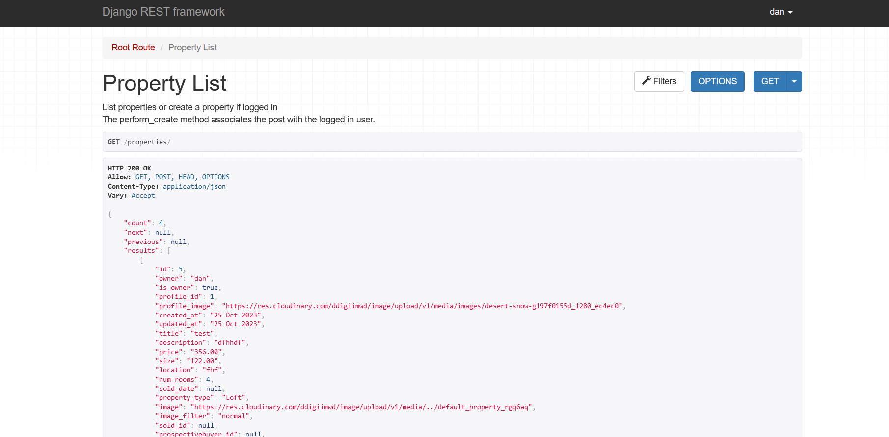
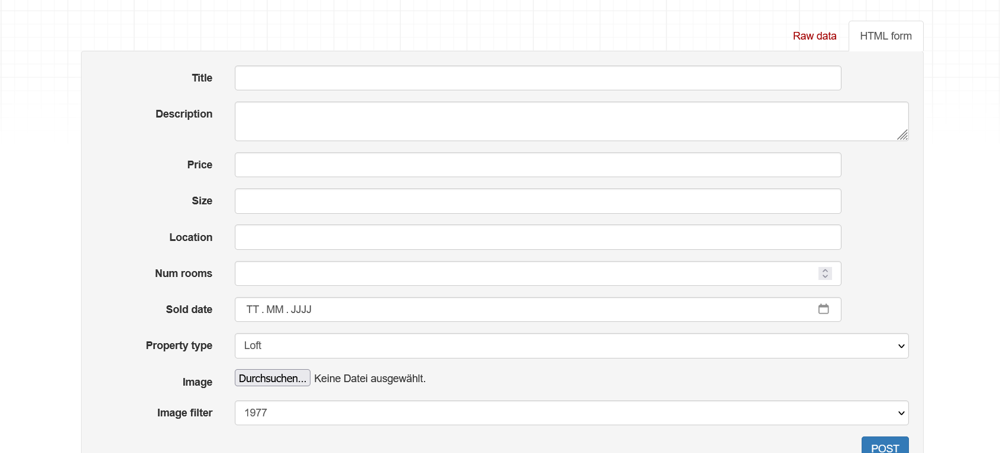
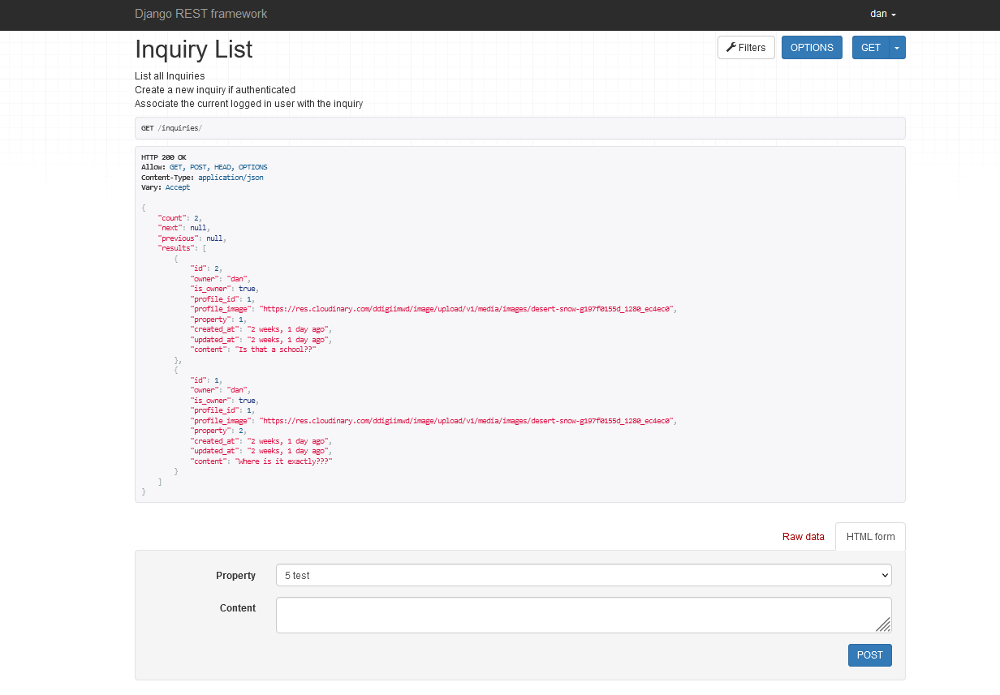
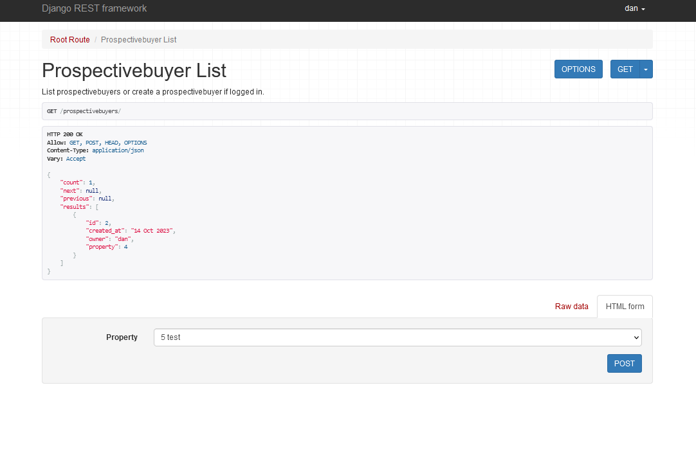
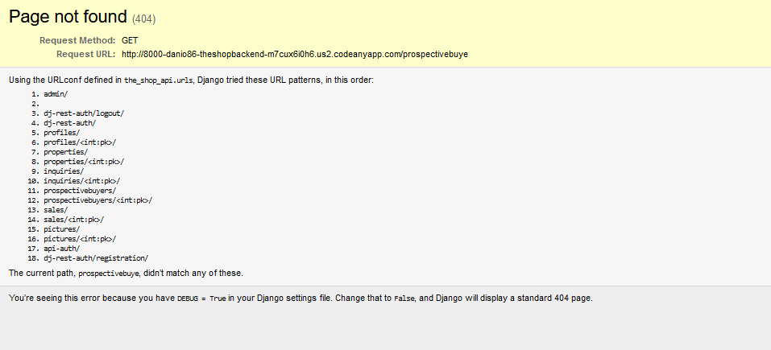

# TheShopBackend

The Shop Backend is the backend project for the TheShop project.
It contains 5 models in which users can create, edit and delete objects. It also has its own front-end view via the Django Resframework in which these objects can also be created, edited and deleted.

The Project can be seen [here](https://the-shop2-0-d8de1f67b769.herokuapp.com/)

## User Stories

- As a Site User I can view a list of propertes, so that I can get relevant information.
- As a site user, I can create, edit and delete objects, properties in order to subsequently change them.
- As a Site User I can register an account so that I can create properties.
- As a Site User / Admin I can view inquiries on an individual properties so that I can read the conversation.
- As a Site Admin/User I can create, read, update and delete inquiries so that I can manage my blog content.
- As a Site User I can leave inquiries on a property so that I can get in contact with the owner.
- As a Site User I can click on a property so that I can read the full content.
- As a Site User I can upload images so that I can support my properties and profile with pictures and add a personal touch to my avatar

## Features

### Property

- The Property Model is the main model in this project. The objects that can be created here are houses or real estate properties. Various attributes, like title, size, price, location, ... can be assigned to them. The model is connected to other child models through a foreign key.
  
- 
  
- 

### Inquiry

- The Inquiry model allows the user to make inquiries about a property. It is a text field that can only be seen by the creator and the owner of the property. The creator can edit or delete the inquiry afterward.
- 

### Prospective-buyer

- The Prospectivebuyer model is also connected to the Property model and allows the user to express interest. The owner of the property can see, based on an icon, how many other users are interested in the property and can potentially get in touch.
- 

### Sales

- The Sales model can be used by the owner of the property. They can click on an icon or a toggle switch to set the status of the property to "sold." This way, it is visible to all other users that the property is already sold.

### Pictures

- The Pictures Model is intended to allow the user to add multiple pictures to their property in the future.

### 404

- If you enter a path that doesn't exist in this project, you will be redirected to a 404 page that provides an overview of all possible paths or all existing models.
 - 

## Testing 

- I have manually tested the program in the Code institute Heroku terminal and in my local terminal.by doing the following:
    - I have tested that the website works in different browsers (Chrome and Firefox).
    - I confirm that the website works and looks good on all standard screen sizes. This was tested with the devtools divice toolbar.
    - I confirm that the all forms are working.
    - I confirm that the the user can create, edit and delete properties and inquiries.
    - Passed the code through the Code institute - PEP8 linter and confirmed that there are no problems

   
 Tested in the Code institute Heroku terminal and in my local terminal.
    CI Python Linter
    

### Validator Testing

  - CI Python PEP8 Linter 
     - No errors were detected when passing through the CI Python PEP8 Linter.

### Unfixed Bugs

 - All Bugs are fixed.

## Deployment

The project was deployed using Code institut's mock for Heroku

    Steps for deployment:
        This repository was cloned.
        A Herroku app was created.
        Added config vars for the secret key, for cloudinary and for the posgresql database.
        The Heroku app was linked to the repository
        Deploy was clicked.

The live link can be found [here](https://the-shop2-0-d8de1f67b769.herokuapp.com/)

## Credits 

### Content

- Instructions on how to structure backend projects, how to work with databasis, how to use Django, Postgresql and Cloudinary, Summernote and Allauth are from [Code Institute - I think therefore I Blog](https://learn.codeinstitute.net/courses/course-v1:CodeInstitute+FST101+2021_T1/courseware/b31493372e764469823578613d11036b/fe4299adcd6743328183aab4e7ec5d13/)
[and](https://learn.codeinstitute.net/courses/course-v1:CodeInstitute+FST101+2021_T1/courseware/dc049b343a9b474f8d75822c5fda1582/a706dbb65b2d467a84e1bf67266851b1/)
- Instructions on how to extend the Django User Model were taken from [Youtube](https://www.youtube.com/watch?v=PtQiiknWUcI&t=9718s)

### Personal Advice

  - Thank You!
    -  Jubril Akolade
    - All people from my Slack Group!